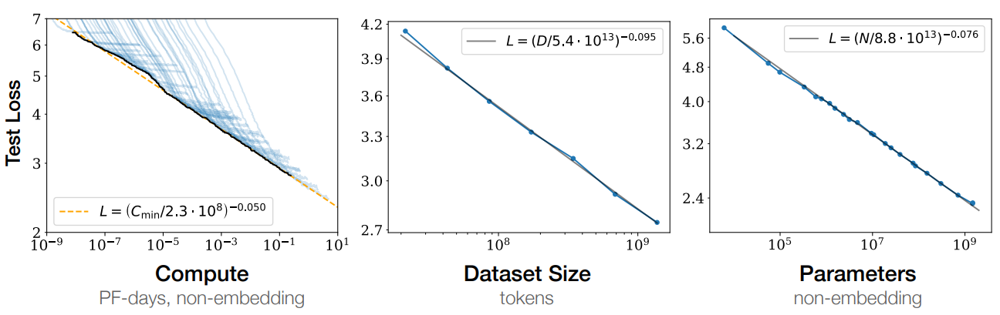
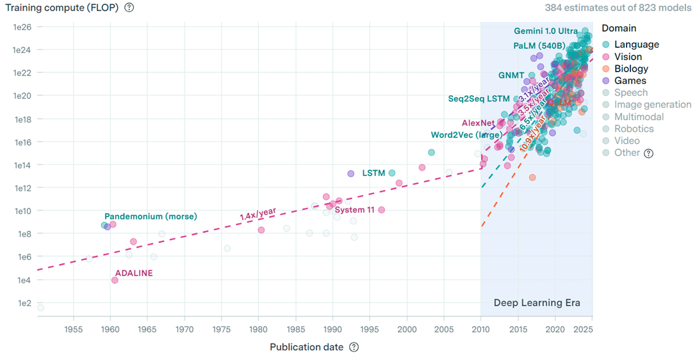
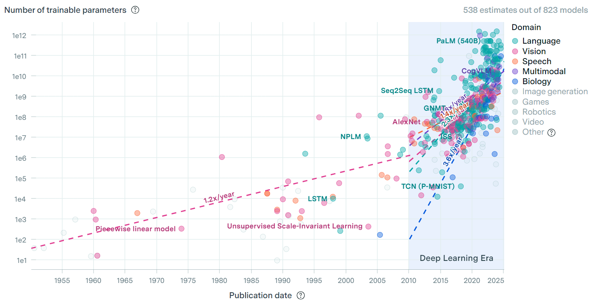
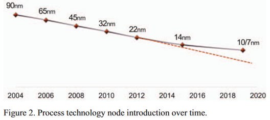
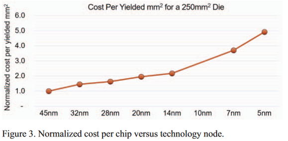
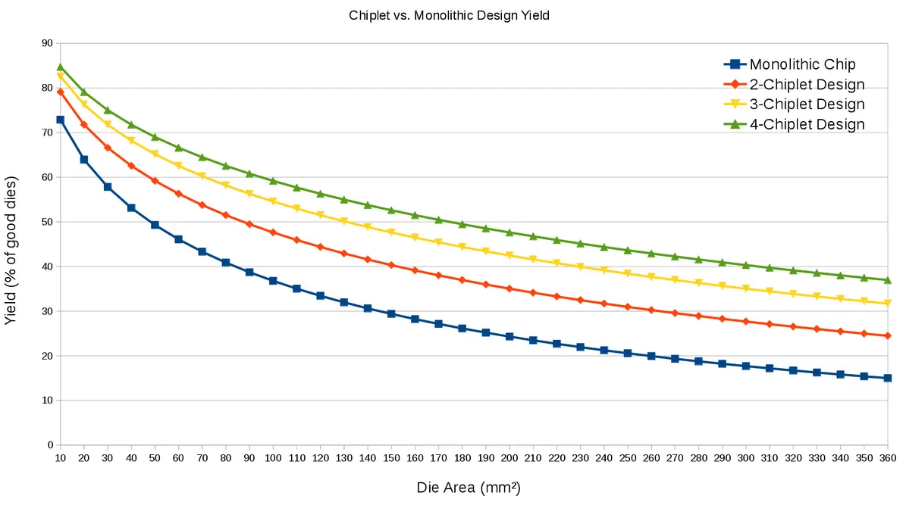
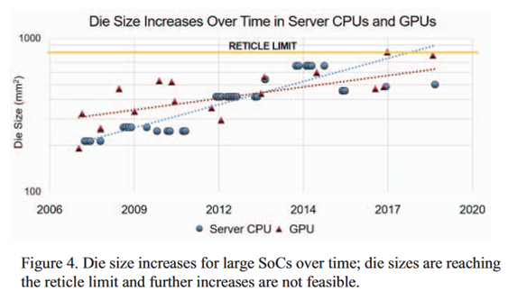
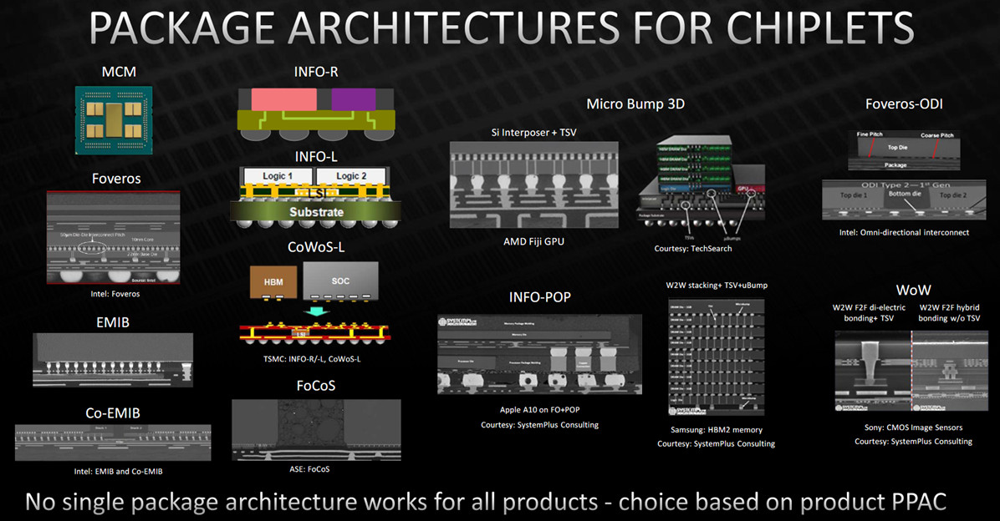

# Why Chiplets Emerged: Scaling Beyond Monolithic Chips

The modern compute boom, especially in AI, has exposed a painful truth: demand is accelerating faster than traditional chip scaling can deliver. For years, the semiconductor industry relied on shrinking transistors and building larger monolithic dies to keep performance climbing. That approach still matters, but it is no longer enough on its own.

Chiplets emerged as a practical answer to this mismatch.

## The Demand Curve Changed

AI workloads are now driving a new wave of system requirements:

- More raw compute for training and inference
- Larger memory capacity and higher memory bandwidth
- Faster communication inside and across devices
- Better interconnect performance in switches and network fabrics

This is not a small, temporary bump. Model scale, training data size, and hardware appetite have all grown rapidly over the last decade. In other words, performance demand is compounding at the same time hardware scaling is becoming harder.

<figure>
	
	<figcaption>Figure 1. Scaling-law behavior: model quality generally improves as compute, data, and parameter count increase.</figcaption>
</figure>

<figure>
	
	<figcaption>Figure 2. Compute demand of notable AI models has increased steeply over time.</figcaption>
</figure>

<figure>
	
	<figcaption>Figure 3. Model parameter counts have also expanded rapidly, amplifying infrastructure pressure.</figcaption>
</figure>

## Why Monolithic Scaling Is Under Pressure

Classic Moore-style progress is slowing down in several ways:

- Process node transitions are harder and slower
- New nodes are significantly more expensive per step
- Physical limits are becoming visible at advanced nodes
- Very large dies suffer lower yield
- Reticle limits cap how far a single die can scale
- Power delivery and thermal constraints become harder at larger scales

Even if monolithic design is still viable for many products, its economic and technical risk increases quickly as die size and complexity grow.

<figure>
	
	<figcaption>Figure 4. Process-node progress continues, but the cadence has slowed compared with earlier decades.</figcaption>
</figure>

<figure>
	
	<figcaption>Figure 5. Newer nodes are increasingly expensive, raising the economic barrier for pure monolithic scaling.</figcaption>
</figure>

<figure>
	
	<figcaption>Figure 6. Larger single dies tend to have lower yield; partitioning into chiplets can improve manufacturability.</figcaption>
</figure>

<figure>
	
	<figcaption>Figure 7. Reticle limits constrain how far monolithic die size can scale.</figcaption>
</figure>

## Chiplets: A New Integration Layer

Chiplets introduce another level in the system hierarchy. Instead of forcing all functions into one giant die, designers can partition functionality into smaller dies and integrate them inside one package.

This shifts scaling from only transistor-level progress to architecture-level and packaging-level progress.

You can think of modern system scaling as a multi-layer problem:

- On-die architecture
- Package-level integration (chiplets)
- Board or machine-level integration
- Rack and cluster-level scaling

Real performance growth comes from balancing all layers, not over-optimizing only one.

## Why Advanced Packaging Matters

Chiplets are not just an architecture idea; they are enabled by packaging technology:

- High-density die-to-die links
- Better substrate and interposer capabilities
- Improved integration methods for heterogeneous dies

Advanced packaging makes it realistic to combine compute, IO, memory-related logic, and other functions from different process nodes in one package.

<figure>
	
	<figcaption>Figure 8. Advanced packaging technologies make multi-die chiplet integration practical at product scale.</figcaption>
</figure>

This creates several advantages:

- Better yield from smaller die sizes
- More flexible design reuse across product lines
- Process-node matching (use leading edge only where it helps most)
- Potentially better cost-performance tradeoffs

## The Core Takeaway

Chiplets are not a replacement for process scaling. They are a response to the limits of relying on process scaling alone.

As AI and large-scale computing continue to grow, the winning strategy is increasingly clear: combine transistor innovation, architecture innovation, packaging innovation, and system-level co-design. Chiplets sit at the center of that transition.